# **Elementos de Navegación**
_Intro a User Experience Desing_

***
## Objetivo:
Reconocer los elementos de navegación de las siguientes páginas: 
1.-[**Breather**](https://breather.com/locations/boston?sorting=relevance&searchMode=hourly)
 2.-[**Github**](https://github.com/)
 3.- [**Medium**](https://medium.com/)

***

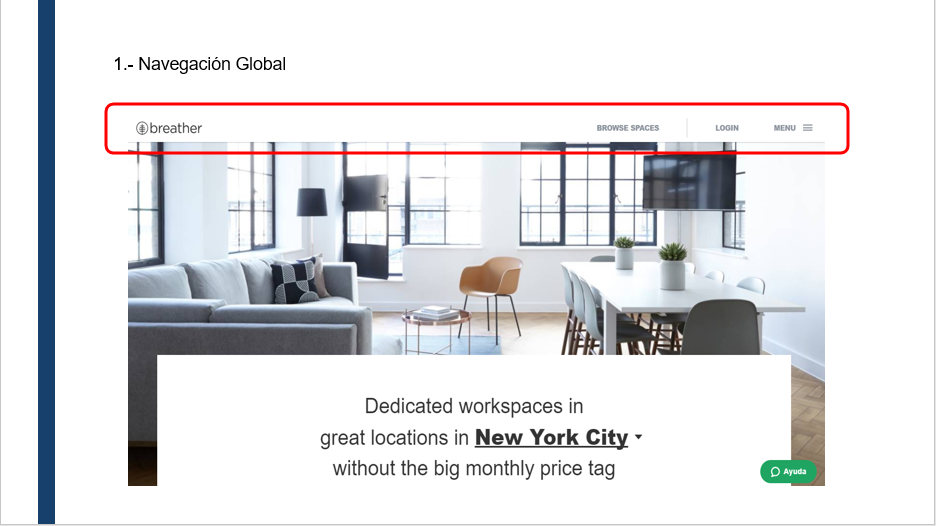
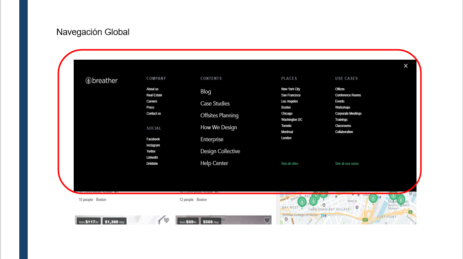
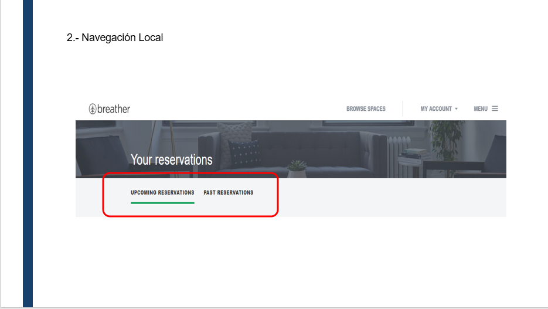
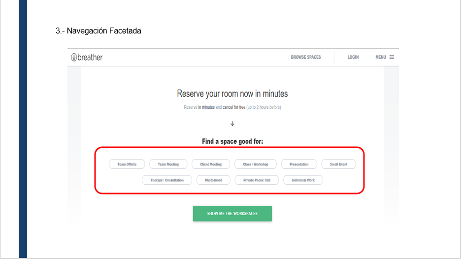
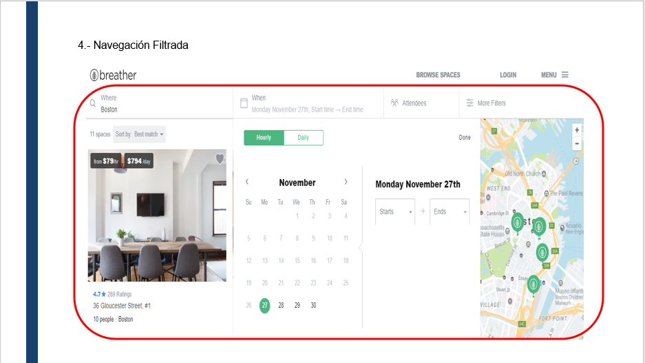
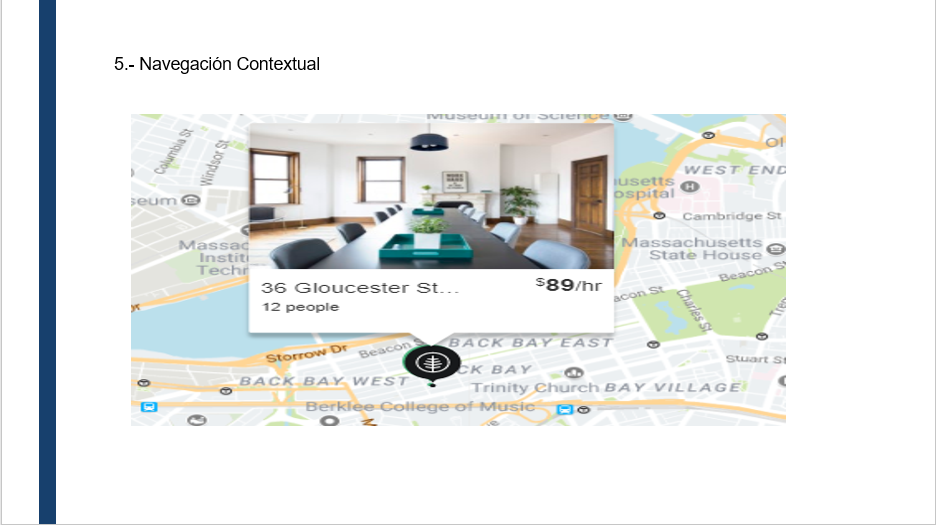
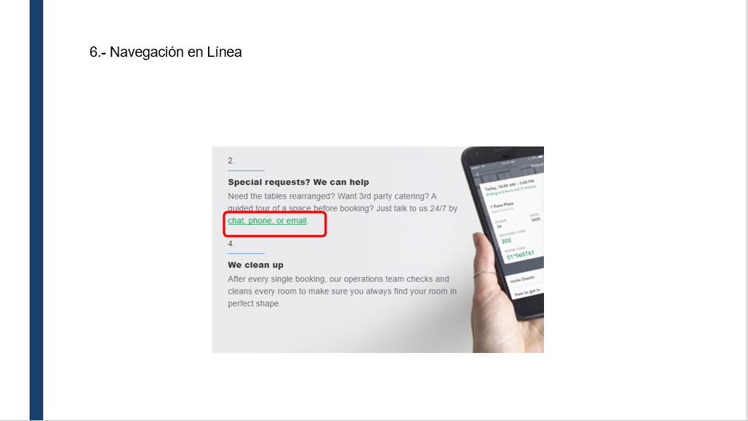

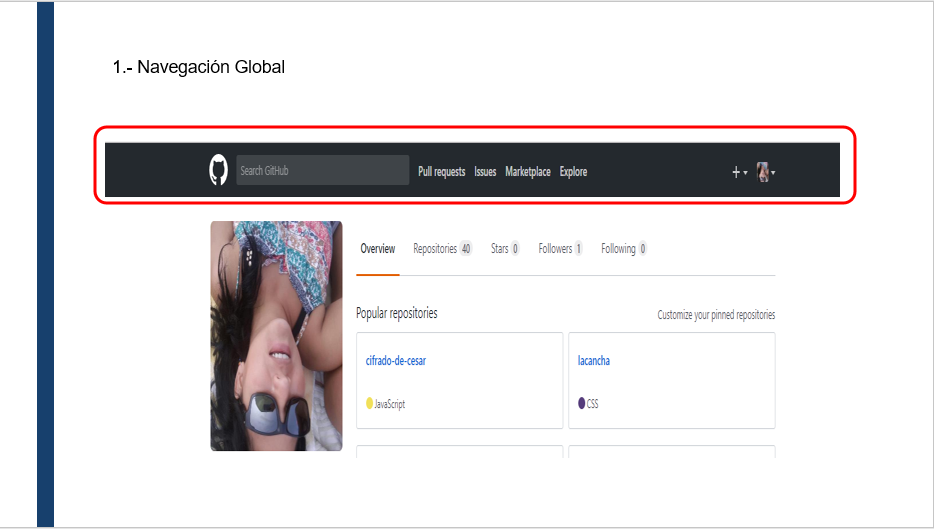
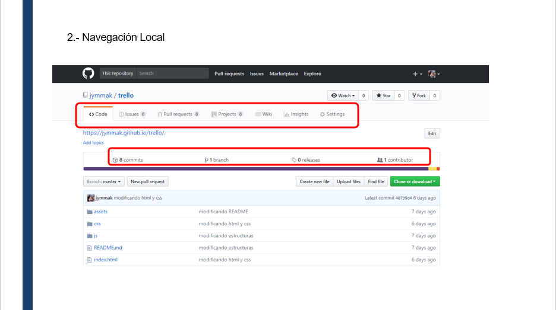
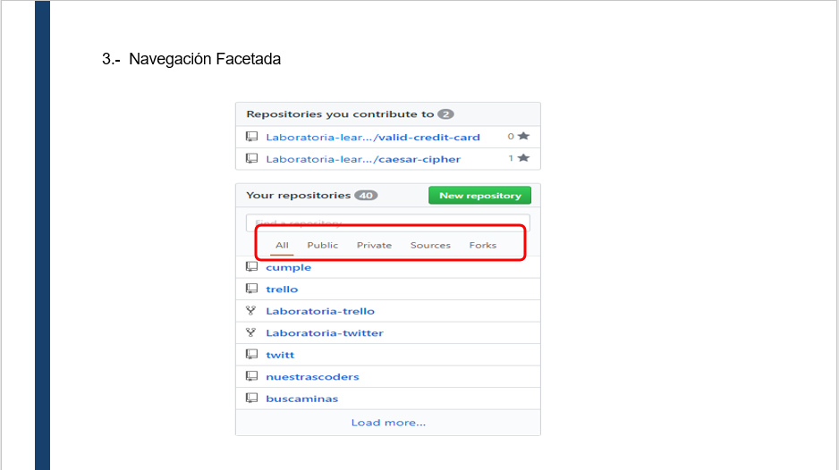
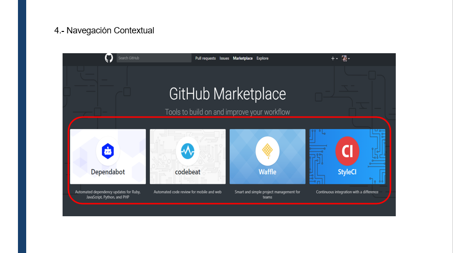
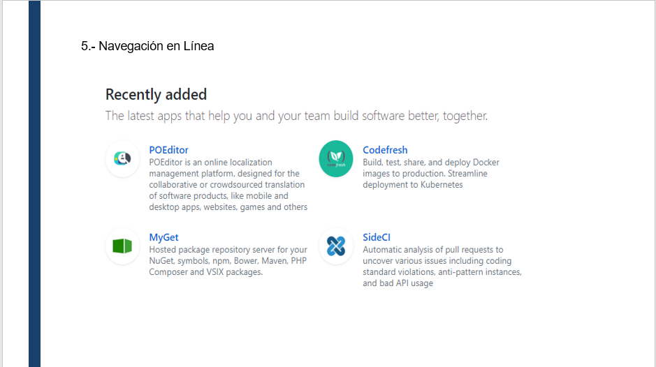

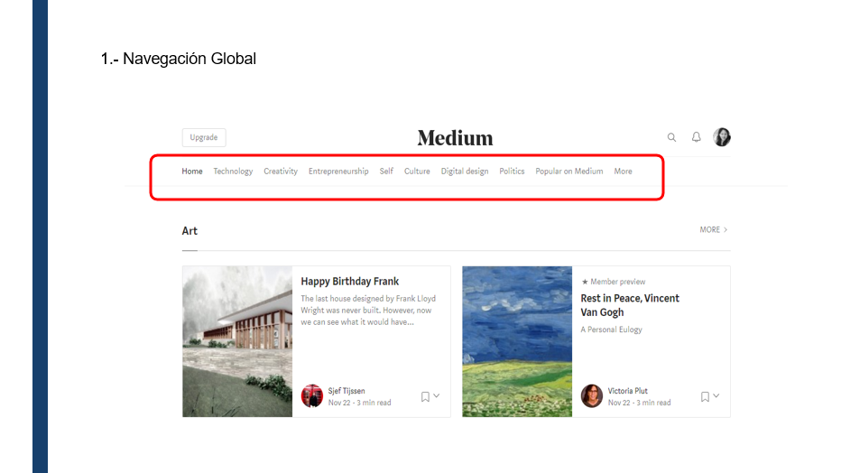
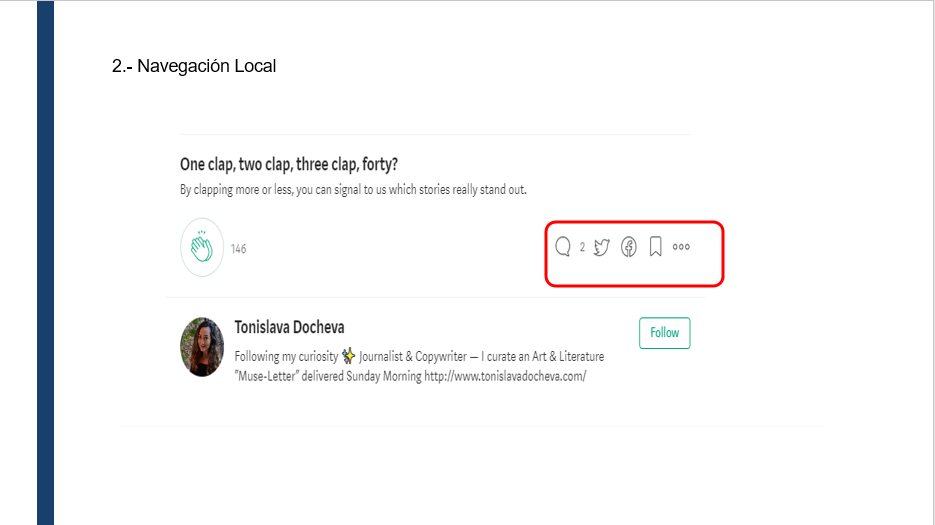
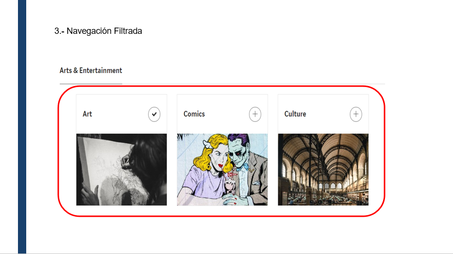
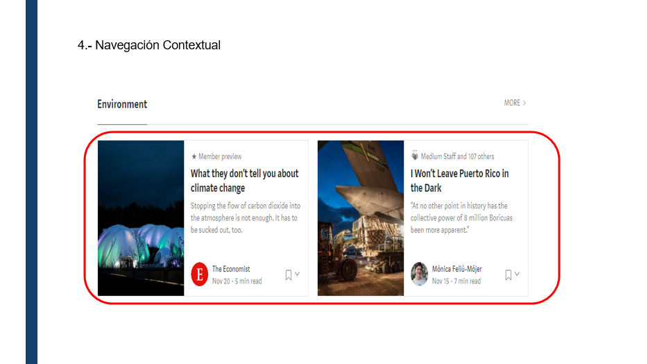
